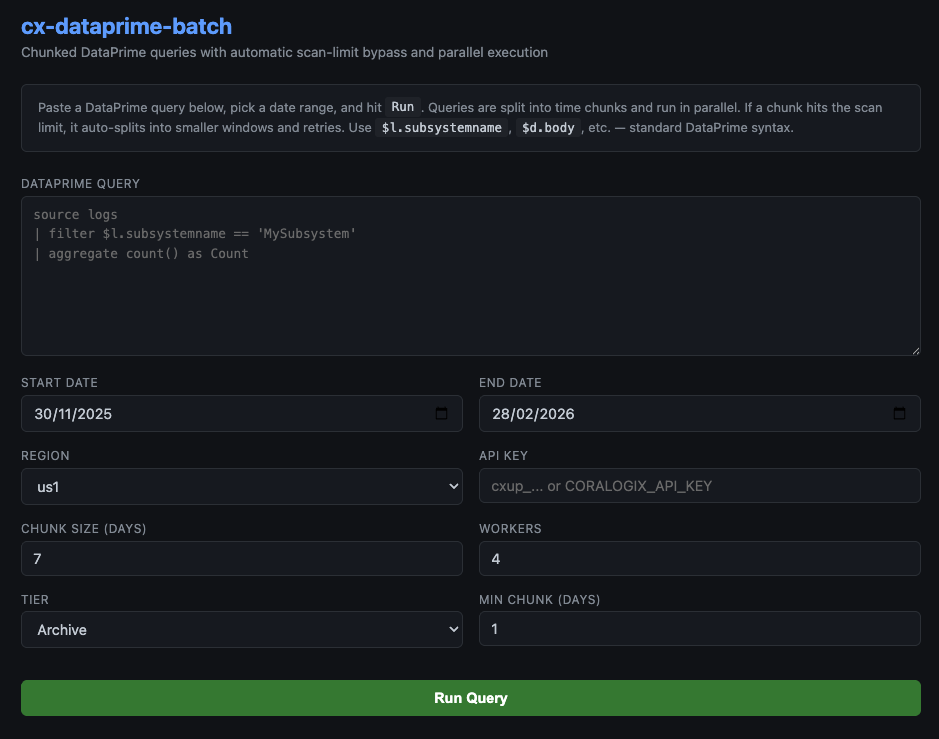

# cx-dataprime-batch

Chunked [DataPrime](https://coralogix.com/docs/dataprime/) queries for Coralogix with automatic scan-limit bypass and parallel execution.

Coralogix enforces scan limits on DataPrime queries that touch large volumes of data. This tool splits your query into time-based chunks, runs them in parallel, and merges the results. If a chunk hits the scan limit, it automatically halves the window and retries until the data fits.



## Features

- **Automatic scan-limit bypass** — detects `bytesScannedLimitWarning` and splits the failing chunk into smaller windows
- **Parallel execution** — configurable worker count for concurrent chunk processing
- **Smart result merging** — auto-detects result type (`count`, `grouped`, `raw`) and merges correctly across chunks
- **Retry on transient errors** — timeouts, connection resets, and server-side shuffle errors are retried automatically
- **CLI + Web UI** — use from the terminal or from a browser

## Quick Start

```bash
pip install -r requirements.txt
```

### CLI

```bash
# Set your API key (or pass -k inline)
export CORALOGIX_API_KEY=cxup_...

# Run a query file over 90 days with 8 parallel workers
python dataprime_chunk.py \
  -f examples/simple_count.dp \
  -s 2025-12-01 -e 2026-03-01 \
  -r us2 -w 8 \
  -o results.csv

# Inline query
python dataprime_chunk.py \
  -q "source logs | filter \$l.subsystemname == 'MyApp' | aggregate count() as Count" \
  -s 2026-01-01 -e 2026-02-01 \
  -r eu1 -o count.csv

# Preview chunks without running (dry run)
python dataprime_chunk.py -f query.dp -s 2026-01-01 -e 2026-03-01 -c 7 --dry-run
```

### Web UI

```bash
python web.py              # http://localhost:5001
python web.py --port 8080  # custom port
```

Paste your DataPrime query, pick a date range, select your region, and hit **Run**. Progress streams live to the browser.

## CLI Options

| Flag | Default | Description |
|---|---|---|
| `-f`, `--query-file` | | Path to `.dp` query file |
| `-q`, `--query` | | Inline DataPrime query string |
| `-s`, `--start` | *required* | Start date (ISO 8601) |
| `-e`, `--end` | *required* | End date (ISO 8601) |
| `-r`, `--region` | `eu1` | Coralogix region (see table below) |
| `-k`, `--api-key` | `$CORALOGIX_API_KEY` | API key |
| `-t`, `--tier` | `TIER_ARCHIVE` | Data tier (`TIER_ARCHIVE` or `TIER_FREQUENT_SEARCH`) |
| `-c`, `--chunk-size` | `7` | Initial chunk size in days |
| `--min-chunk-size` | `1` | Minimum chunk before skipping a window |
| `-w`, `--workers` | `4` | Parallel workers |
| `-o`, `--output` | *stdout* | Output file (`.csv` or `.json`) |
| `--retries` | `3` | Retries per chunk on transient errors |
| `--delay` | `0.2` | Seconds between chunk submissions |
| `--base-url` | | Override the API base URL (e.g. PrivateLink) |
| `--dry-run` | | Preview chunks without executing |

## Regions

| Alias | Endpoint |
|---|---|
| `us1` | `api.coralogix.us` |
| `us2` | `api.cx498.coralogix.com` |
| `eu1` | `api.coralogix.com` |
| `eu2` | `api.eu2.coralogix.com` |
| `ap1` | `api.coralogix.in` |
| `ap2` | `api.coralogixsg.com` |
| `ap3` | `api.ap3.coralogix.com` |
| `cx498` | `api.cx498.coralogix.com` |

Use `--base-url` to override with a custom endpoint (e.g. PrivateLink).

## How It Works

```
   Query + Date Range
          │
          ▼
  ┌──────────────────┐
  │  Split into N    │
  │  time chunks     │
  └──────┬───────────┘
         │
         ▼
  ┌──────────────────┐     ┌───────────────────┐
  │  Run chunks in   │────▶│  Scan limit hit?  │
  │  parallel (N     │     │  Auto-split chunk  │
  │  workers)        │◀────│  and retry         │
  └──────┬───────────┘     └───────────────────┘
         │
         ▼
  ┌──────────────────┐
  │  Merge results   │
  │  (count/grouped/ │
  │   raw)           │
  └──────┬───────────┘
         │
         ▼
     CSV / JSON / Table
```

## Query Files

Store DataPrime queries in `.dp` files. See `examples/` for templates:

- `examples/simple_count.dp` — basic log count by subsystem
- `examples/fee_lookup_by_country.dp` — join-based fee lookup aggregation
- `examples/error_code_by_api.dp` — error code grouping with agent ID extraction
- `examples/api_lookup_join.dp` — generic API lookup with guid correlation and country filter

Replace `<SUBSYSTEM>`, `<HOST>`, `<COUNTRY>`, etc. with your actual values.

## License

MIT
